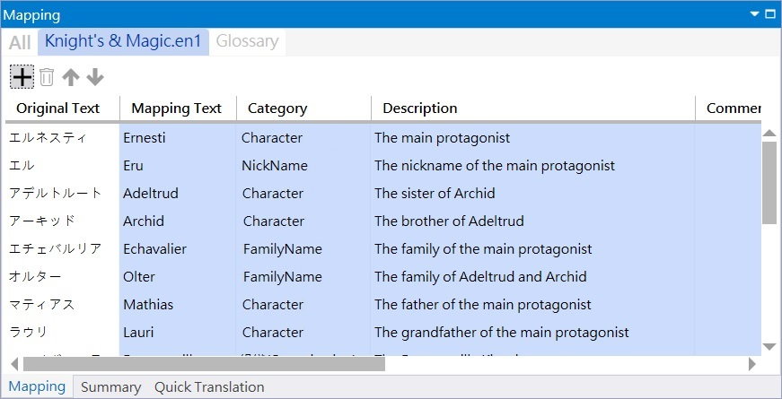

# Minax Web Translator (MWT) Concepts

## Simple Concepts
- Step 1: Input source text.
- Step 2: Replace each `MappingEntry`'s `OriginalText` to a non-replaceable string for each translator/translation platform.
- Step 3: Invoke remote Translator/Translation site to perform **Statistical Machine Translation** (**SMT**), **Neural Machine Translation** (**NMT**), or other translation technologies.
- Step 4: Receive translated text which contains non-replaceable strings.
- Step 5: Replace each non-replaceable string to corresponding `MappingEntry`'s `MappingText` .

That's all.  

 

### Non-replaceable string
This term means the string would be keeped after translating, like "ABC123".
- In fact, many translating engines would replace text to strange format, like "1.23" to "1,23". It seems caused by localization culture number format.
- Therefore, we shall find the non-replaceable string format rules for each engine.
- Some translating engine, like **Microsoft Translator Text API V3**, directly support this feature by inserting some pre-defined HTML element class name

 

### Translator or Translation
These two terms are almost exchangeable in all cases. However, we use **Translator** to mean *Web Page based translator site* like Google Translate. Meanwhile, use **Translation** for *API-based translation service* like Google Translation API v2.
 
 

## MappingEntry
This class contains five fields:
1. `OriginalText`: The original text want to replace or keep. **This field cannot be empty but maybe full of whitespace text** .
2. `MappingText`: The mapping text want to be replaced or keeped.
3. `Category`: This `MappingEntry`'s category to classify. Such as character name, family name, material, etc..
4. `Description`: The text describe this `MappingEntry`'s meanings or comments.
5. `Comment`: The extra text to comment this `MappingEntry` about something.

The screenshot:

 

MappingEntry entries are located in
1. Translation Project file
2. Glossary Mapping file(s)

 

## Folders
- Base Project folder
  - The folder contains Translation Project file is the base project folder, like [TranslationProjects](https://github.com/nuthrash/Minax/tree/master/MinaxWebTranslator/TranslationProjects/)
  - It is not necessary to consider as a dedicated folder for a project, and you can put many project files in same folder.
  - In the contrary, this folder is parsed from the file name of opened project, MWT would not delete other project file forcibly.
- Glossary folder
  - The glossary Mapping files locate in Glossary/* sub-folders, like [TranslationProjects/Glossary](https://github.com/nuthrash/Minax/tree/master/MinaxWebTranslator/TranslationProjects/Glossary/)
  - You cannot specify Glossary path or folder name. It shall be named "Glossary" folder name and located inside base project path.

 

## Glossary File
A glossary file is a file which stores some mapping text/terms.
It might be a simple two columns text file, table-based text file, Excel file, Translation Memory eXchange (TMX) XML file, or other translation related file format.

 

### Supported File Formats
- Currently, MWT only support tab-separated values (TSV) .tsv and camma-separated values (CSV) .csv (MWT would detect by itself!)
- **Each file shall be UTF-8 encoded with BOM** .
- Columns
  - First row may be Column Name, or row data
  - Like `MappingEntry`, when a glossary file has first row with Column Name, their sequence is prefer `OriginalText`, `MappingText`, `Category`, `Description`, and `Comment`.
  - Otherwise, first-two column names shall be `OriginalText` and `MappingText`. Other fields are optional.
  - That means, **each glossary file shall has at least two columns** for `OriginalText` and `MappingText` (like [Google Translation toolkit](https://translate.google.com/toolkit) ), and the Column Name row is not necessary.

## Mapping Priority
When there are some glossary files and Project configuration file, they have themselves Mapping tables.
Therefore combine them to a merged Mapping table shall sort all entries with priority.  

The project folder might look like [TranslationProjects](https://github.com/nuthrash/Minax/tree/master/MinaxWebTranslator/TranslationProjects/) , but the folder itself is not necessary.
Just a Project configuration file (.conf) is enough to use this App, and the Glossary sub-folders can create later.

Priorities from high to low are:
1. Project configuration file's Mapping entries
2. Cross remote translator/translation engine(s) glossary Mapping entries
3. Remote translator/translation engine's glossary Mapping entries
4. Remote translator/translation engine's `<SourceLanguage>2<TargetLanguage>` glossary Mapping entries

That means any Mapping entry can be overwritten by Translation Project Mapping entry.

Merge sequence:
1. From deepest glossary Mapping files to Translation Project file
  - The formers would be overwritten by later.
2. From smaller glossary file name to larger when all glossary files are sorted by numeric sequence in same folder
   - This rule is focus on the files have same prefix string with number file names.
   - Example: The entry with same `OriginalText` content in File1.csv would be overwritten by File2.csv
   - Therefore, you can create your own glossary file to overwrite other glossary Mapping entries by give it a vary large number file name, like File99999.csv.
3. Besides 2., other glossary Mapping files would be sorted by alphabet sequence, then merge them from a to z.
   - In fact, it is prefer to **put same Category Mapping entries to files with same prefix string plus number**, like MiscTerms1.csv, MiscTerms2.csv.
   - If you put many different Category entries in a file, it is not determining what is the last entry to be merged.
4. If cannot find any glossary Mapping file in Glossary sub-folders, it is OK, MWT would go through with Mapping entries inside Project file

### File Changed Monitoring

Only <u>MWT Windows Desktop version</u> has this feature!
- When a new glossary Mapping file put into Glossary sub-folders
  - Any Mapping entry with same `OriginalText` content may be replaced or not, totally depends on the priority rules.
  - In addition, the new file name shall also to be considered!
- When an existed glossary Mapping file was deleted
  - The merged Mapping entries would be re-sorted with priority
  - When some Mapping entries have same `OriginalText` content, highest priority entry would become current entry.
  - That means, the `MappingText` content would be replaced from "ABC" (old entry) to "CBA" (current entry).

 

---

# Translation API Services

## Microsoft Translator Text API v3.0

- Documents: https://docs.microsoft.com/en-us/azure/cognitive-services/translator/reference/v3-0-reference
- How to sign-up: https://docs.microsoft.com/en-us/azure/cognitive-services/translator/translator-text-how-to-signup

## Google Cloud Translation API v2

- Documents: https://cloud.google.com/translate/docs
- How to create API key: https://cloud.google.com/docs/authentication/api-keys
- Cloud Translation API v3 (beta): https://cloud.google.com/translate/docs/intro-to-v3
  - In this version, it seems has free quota (200000? words)!!

## Baidu Translation API (百度翻译开放平台)

- Documents (简体中文): http://api.fanyi.baidu.com/api/trans/product/apidoc 
- Where to request APP ID and Secret Key (简体中文): http://api.fanyi.baidu.com/api/trans/product/desktop  

## Youdao Translation API (有道智云翻译 API)

- Docuemnts (简体中文): https://ai.youdao.com/docs/doc-trans-api.s#p01
- Where to request App Key (App ID) and App Secret (简体中文): https://ai.youdao.com/doc.s#guide

