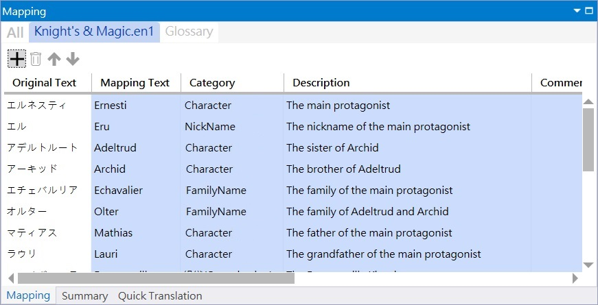

# Minax Web Translator (MWT) 概念

## 簡易概念
- 第一步： 輸入來源文字
- 第二步： 針對每個翻譯器/翻譯服務平台替換每個 `MappingEntry` 的 `OriginalText` 內容為<u>不會被替換的字串</u>
- 第三步： 叫用遠端翻譯器/翻譯服務網站來執行 **Statistical Machine Translation**（**SMT**，統計式機器翻譯）、**Neural Machine Translation**（**NMT**，類神經式機器翻譯）或其他翻譯技術
- 第四步： 接收翻譯完成的文字中內含<u>不會被替換的字串</u>
- 第五步： 替換每個<u>不會被替換的字串</u>為相對應`MappingEntry`的`MappingText`內容

就這樣。  

 

### 不會被替換的字串（Non-replaceable string）
此術語代表該字串在翻譯過程會盡量保持原樣，像是「ABC123」字串
- 事實上，許多翻譯引擎會將一些文字翻譯成怪怪的格式，比如說將「1.23」換成「1,23」。這似乎是因為本地化地區文化數字格式所造成的。
- 因此，必須針對每個引擎找出與之相應的<u>不會被替換字串</u>格式
- 某些翻譯引擎，比如 **Microsoft Translator Text API V3**，則是藉由將某些字加上預先定義的 HTML 標籤 `class` 元素名稱來直接支援此功能

 

### 翻譯器（Translator）或翻譯服務（Translation）
這兩個名詞基本上在大部分的狀況下都可互換。不過，在此使用**翻譯器（Translator）** 來指涉像是 Google Translate 的*網頁式翻譯器網站*。
同時，**翻譯服務（Translation）** 則是來指涉像是 Google Translation API v2 的 *API式翻譯服務*。
 
 

## MappingEntry
這個類別包含五個欄位：
1. `OriginalText`： 想要替換或是保留的原始文字。**這個欄位不可為空但也許可以是全空字串** 。
2. `MappingText`： 想要被替換或保留的對應文字
3. `Category`： 對此 `MappingEntry` 分類用，比如說角色名字、家族名、材質等等。
4. `Description`： 描述此 `MappingEntry` 的意義或是註解
5. `Comment`： 此 `MappingEntry` 額外的註解文字

截圖：

 

MappingEntry 條目位於
1. 翻譯專案檔案
2. Glossary Mapping 檔案

 

## 各種目錄
- 基礎專案目錄
  - 放置翻譯專案檔的目錄被認知為基礎專案目錄，類似 [TranslationProjects](https://github.com/nuthrash/Minax/tree/master/MinaxWebTranslator/TranslationProjects/)
  - 沒有必要為每個專案建立其專用的目錄，可以將多個專案檔案放到同一目錄中。
  - 另一方面來看，這個目錄是經由開啟的專案檔名來解析，MWT 並不會強制刪除其他專案檔。
- Glossary 目錄
  - Glossary Mapping 檔案位於 Glossary/* 子目錄，參照 [TranslationProjects/Glossary](https://github.com/nuthrash/Minax/tree/master/MinaxWebTranslator/TranslationProjects/Glossary/)
  - 你無法指定 Glossary 路徑或目錄名稱。它的目錄名稱應被命名為 "Glossary" 並位於基礎專案目錄之中。

 

## Glossary 檔案
Glossary 檔案是用於儲存一些 Mapping 文字或術語的檔案。
它可以是一個簡單的2欄文字檔、表格式文字檔、Excel 檔、Translation Memory eXchange (TMX) XML 檔，或是其他翻譯相關檔案格式。

 

### 支援檔案格式
- 目前，MWT 僅支援 tab-separated values (TSV) .tsv 和 camma-separated values (CSV) .csv (MWT 會自己偵測！)
- **每個檔案都應為帶有 BOM 的 UTF-8 編碼的檔案** .
- 列（Columns）
  - 第一行可為列名（Column Name）或行資料（row data）
  - 就像 `MappingEntry`，當 Glossary 檔案的第一行是列名時，它們的次序應該是 `OriginalText`、`MappingText`、`Category`、`Description`與`Comment`。
  - 除此以外，前兩列名應為 `OriginalText`與`MappingText`。其他欄位是可選的。
  - 這也就是說，**每個 Glossary 檔案最少需要兩列** 分別給`OriginalText`和`MappingText`用（像是 [Google Translation toolkit](https://translate.google.com/toolkit) 所要求的），而列名行則是並非必要的。

## Mapping 優先級
當同時存在多個 Glossary 檔案和一個專案組態檔時，它們有各自的 Mapping 表。
因此該依據優先級來整合它們為一個合併的 Mapping 表。  

專案目錄看起來像是 [TranslationProjects](https://github.com/nuthrash/Minax/tree/master/MinaxWebTranslator/TranslationProjects/) ，但是目錄本身並非是必要的。
本程式只要有一個專案組態檔（.conf）就可正常運作了，而 Glossary 子目錄則可以稍後再建立。

由高到低的優先權是：
1. 專案組態檔的 Mapping 條目
2. 跨遠端翻譯器/翻譯引擎 Glossary Mapping 條目
3. 遠端翻譯器/翻譯引擎的 Glossary Mapping 條目
4. 遠端翻譯器/翻譯引擎的 `<SourceLanguage>2<TargetLanguage>` Glossary Mapping 條目

這代表任何 Mapping 條目可以被翻譯專案的 Mapping 條目所覆寫。

合併次序：
1. 從最深的 Glossary Mapping 檔案到翻譯專案檔
   - 前者可被後者覆寫
2. 從較短到較長檔名的 Glossary 檔案，當同目錄下所有 Glossary 檔案被依照數字序列來排序時
   - 這是著眼在檔名命名規則帶有同樣前置文字加上數字時
   - 例如：在 File1.csv 中，帶有和 File2.csv 相同 `OriginalText` 內容的條目會被其覆寫
   - 因此，你可以建立一個帶有夠大數字的 Glossary 檔名來覆寫其他 Mapping 條目，像是 File99999.csv 之類的。
3. 除了 2. 之外，其他 Glossary Mapping 檔案會被依據字母序列（Alphabet Sequence）來排序，從 a 到 z 依序整併起來。
   - 事實上，比較建議 **將同樣分類（Category）的 Mapping 條目放在具有同樣前置文字加上數字的檔案**，比如說 MiscTerms1.csv 和 MiscTerms2.csv。
   - 如果你將不同分類的條目放在同一檔案時，無法確定那個條目是最後會被合併的條目。
4. 如果無法在 Glossary 目錄中發現任何 Mapping 檔案，那也沒關係，MWT 可以只使用專案檔中的 Mapping 條目來運作

### 檔案變更監視

僅有 <u>MWT Windows 桌面版</u> 具有此功能！
- 當一個新的 Glossary Mapping 檔案被放到 Glossary 子目錄時
  - 任何帶有相同 `OriginalText` 內容的 Mapping 條目是否會被取代，完全依據優先權規則。
  - 此外，新檔案名稱也應該納入考量！
- 當一個現存的 Glossary Mapping 檔案被刪除時
  - 已被合併的 Mapping 條目會依據優先權被重新排序
  - 當帶有相同 `OriginalText` 內容有許多 Mapping 條目時，最高優先權的條目會變為目前的條目
  - 這也就是說，`MappingText` 內容有可能會從 "ABC"（舊條目）被替換為 "CBA"（目前條目）

 

---

# 翻譯服務 API

## Microsoft 翻譯工具文字（Translator Text） API v3.0

- 文件： https://docs.microsoft.com/zh-tw/azure/cognitive-services/translator/reference/v3-0-reference
- 如何註冊： https://docs.microsoft.com/zh-tw/azure/cognitive-services/translator/translator-text-how-to-signup

## Google Cloud Translation API v2

- 文件： https://cloud.google.com/translate/docs
- 如何創建 API 金鑰： https://cloud.google.com/docs/authentication/api-keys
- Cloud Translation API v3 （公開測試版）： https://cloud.google.com/translate/docs/intro-to-v3
  - 這個版本似乎開始提供了免費的翻譯配額（500000? 個字）！！

## Baidu Translation API (百度翻译开放平台)

- 文件（简体中文）： http://api.fanyi.baidu.com/api/trans/product/apidoc 
- 上哪兒索取 APP ID 和密鑰(Secret Key) （简体中文）： http://api.fanyi.baidu.com/api/trans/product/desktop  

## Youdao Translation API (有道智云翻译 API)

- 文件（简体中文）： https://ai.youdao.com/docs/doc-trans-api.s#p01
- 上哪兒索取應用ID(appKey)和應用密鑰(APP Secret) （简体中文）： https://ai.youdao.com/doc.s#guide

