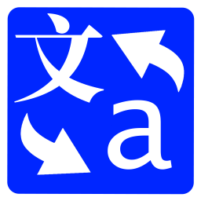

# Overview
**Minax Web Translator** app is **not** a translator. It just an **agent and text mapping-replacer** for remote web translator/translation result.
It works with some online web sites and APIs, such as Excite, CROSS-transer, Weblio, Baidu, Youdao, Google, Microsoft/Bing etc..

- Wiki: https://github.com/nuthrash/Minax/wiki
- Sample Projects: https://github.com/nuthrash/Minax/tree/master/MinaxWebTranslator/TranslationProjects

 

---

# Concepts and Translation API information
See [Conepts.md](./Concepts.md)
 
 

---

# Usage and Requirements
## Windows Desktop
- Project Folder: [MinaxWebTranslator.Desktop](https://github.com/nuthrash/Minax/tree/master/MinaxWebTranslator/MinaxWebTranslator.Desktop)
- System Requirement
  1. Operating System: Windows 7 Service Pack 1 (SP1) and above
  2. .Net Framework: [4.7](https://dotnet.microsoft.com/download/dotnet-framework/net47) and above
  3. Privileged Access: local storage, network

### Main Window

- Startup
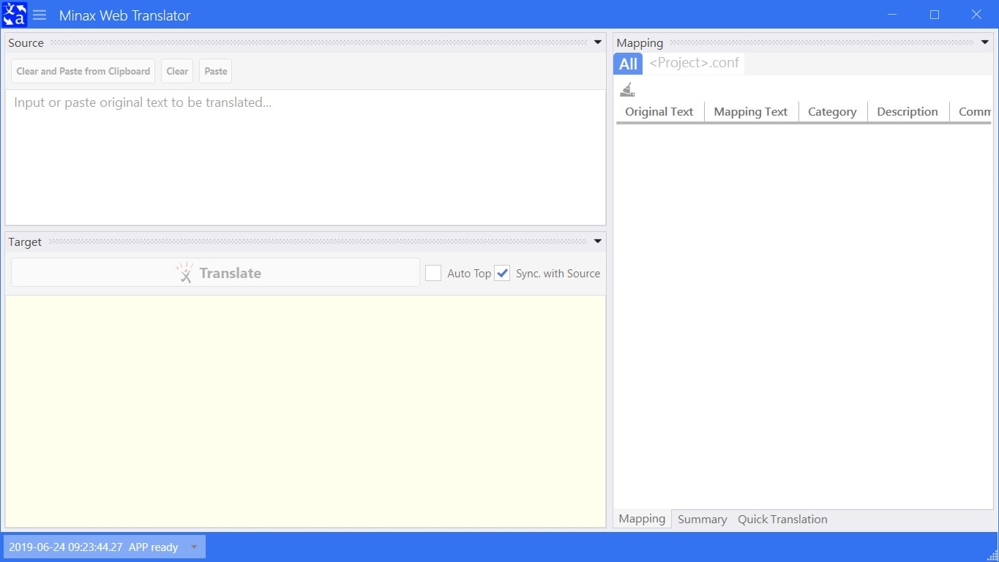

- Draggable and Dockable Panels
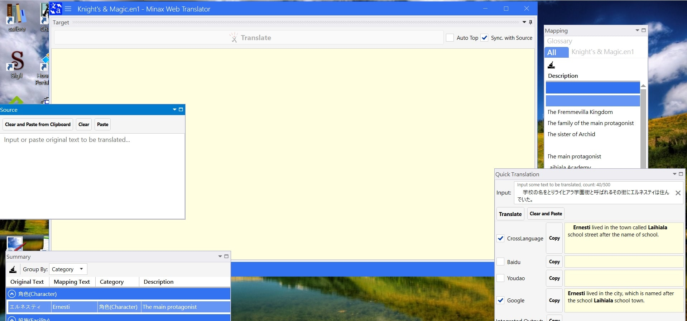
  - You can drag and dock each panel to anywhere  
  - And restore to original docking layout by Menu -> Panel Layout -> Restore Default  
 
 

- Hideable Panels
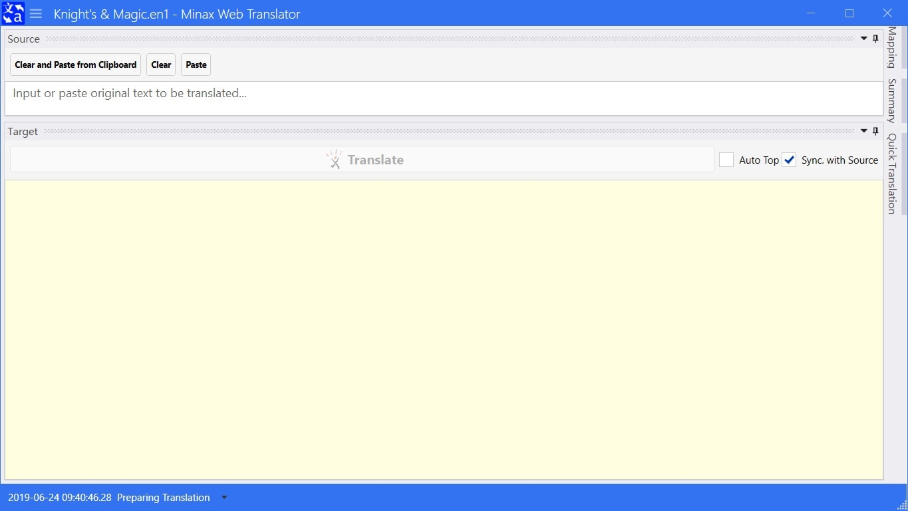
  - You can hide some panels to focus on Target panel

### Menu
- Project New, Open, Save, Close, and Recent Project(s)
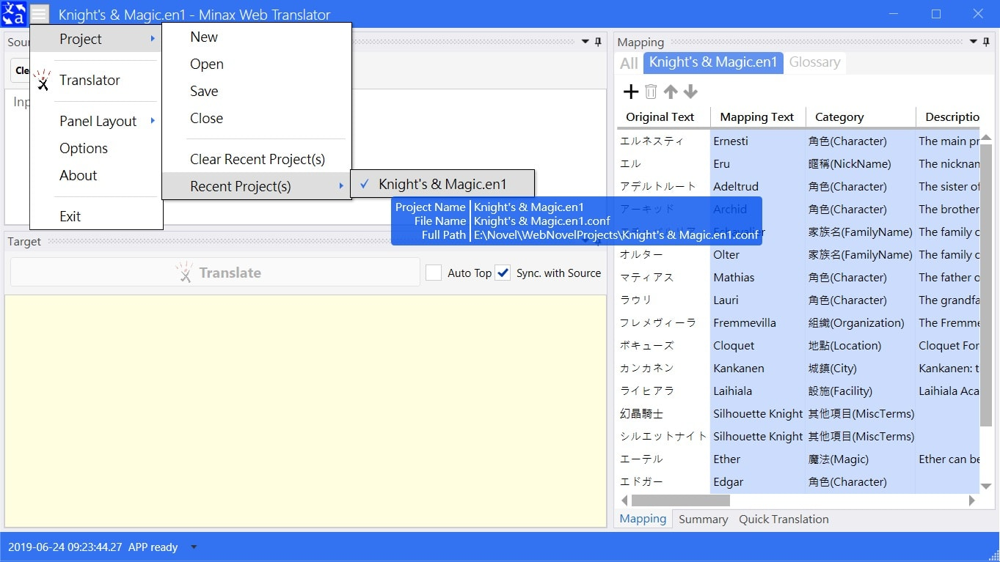
  - Create New Project: Menu -> Project -> New  
  - Open Existed Project: Menu -> Project -> Open  
  - Save Opened Project: Menu -> Project -> Save  
  - Close Opened Project: Menu -> Project -> Close  
  - Open One of Recent Project(s): Menu -> Project -> Recent Project(s) -> Click desired project  
    - When mouse stop on one recent project item, it would popup tooltip table to show some information about it.  
 

- Translator
  - Select Translator and fill required field(s): Menu -> Translator
  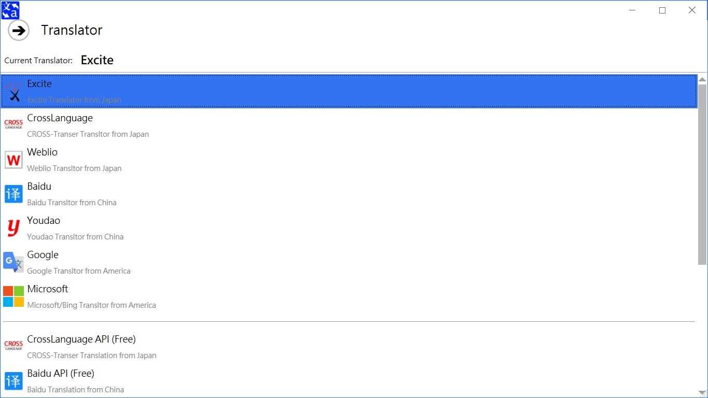  
  - When select a **charged** Translation API, you might fill required field(s) or keep blank util click Translate button to ask it or them.
  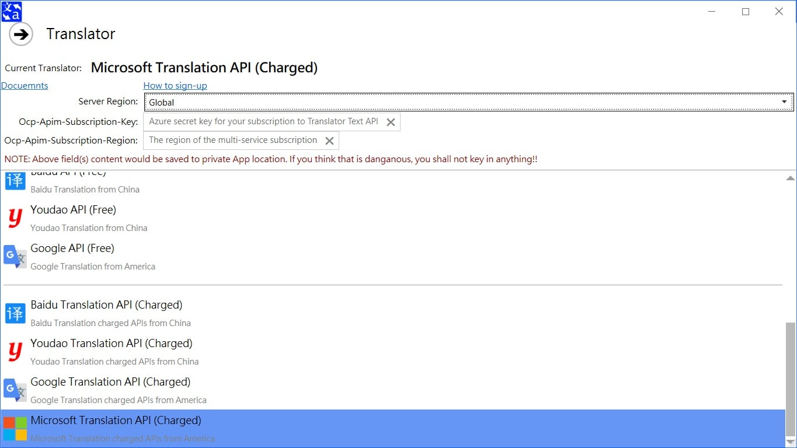

### Translating
This feature is the main feature of this App to translate large size text.
- Step 1: Open or create a Translation Project
- Step 2: Select a desired Translator (Menu -> Translator)
- Step 3: Create/Modify some mapping item in Mapping panel
- Step 4: Fill some text to Source box in Source panel
- Step 5: Click Translate button in Target panel
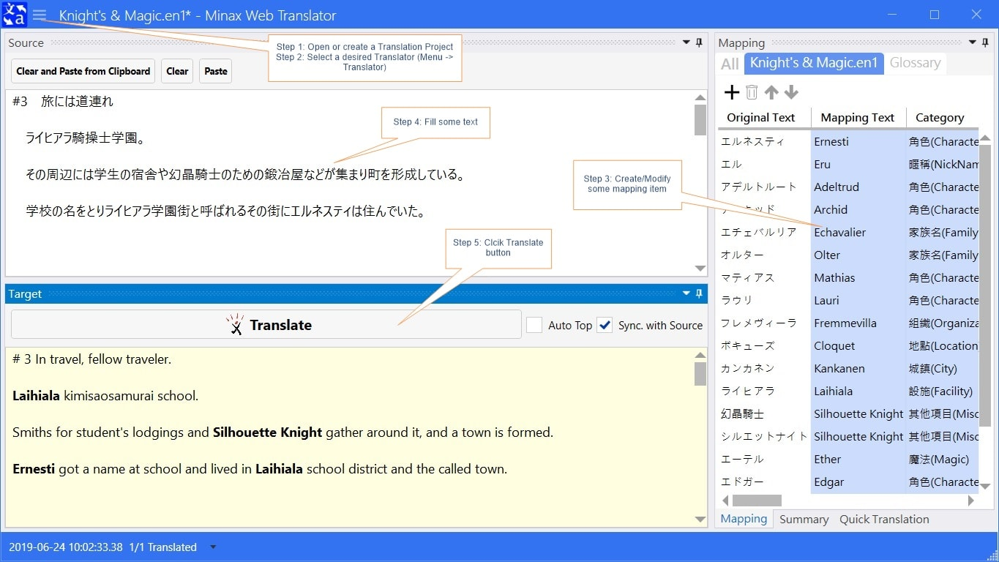
  - The translated text would show on the Target box in Target panel.  
  - The mapped text world be marked with bold.  

   

### Quick Translation
This feature is a simple feature to quick translate small piece of text,
therefore the Input box is restricted to max 500 words.

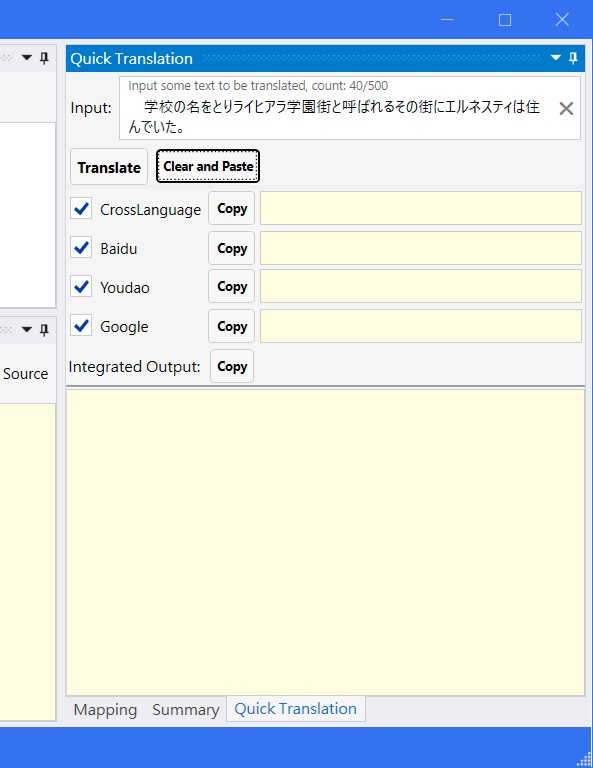

The basic usage is same with main translating feature, besides you select multiple Translators to translate short text simultaneously.
And the "Integrated Output" box would integrate all selected Translators' output to a single section.

---

## Xamarin.Forms
- Base Project Folder: [MinaxWebTranslator](https://github.com/nuthrash/Minax/tree/master/MinaxWebTranslator/MinaxWebTranslator)
- System Requirement
  1. Operating System: depends on each sub-package's platform
  2. Privileged Access: local storage, network

### Android
- Project Folder: [MinaxWebTranslator.Android](https://github.com/nuthrash/Minax/tree/master/MinaxWebTranslator/MinaxWebTranslator.Android)
- System Requirement
  1. Operating System: Android 5.0 (API Level 21 - Lollipop) and above
  2. Target API Version: Android 9.0 (API Level 28 - Pie)
  3. Privilege Access: local storage, network, cache, diagnostic, account, external store, write settings, write secure settings

#### Main Page
- Startup

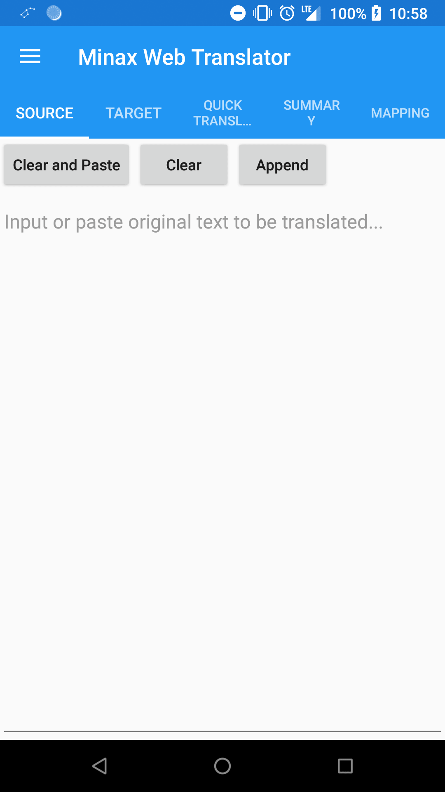

#### Menu
- No project opened
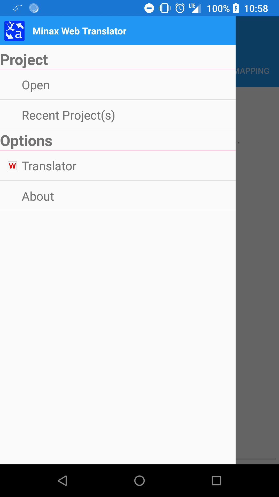

- Project opened (some menu items would show after project opened)
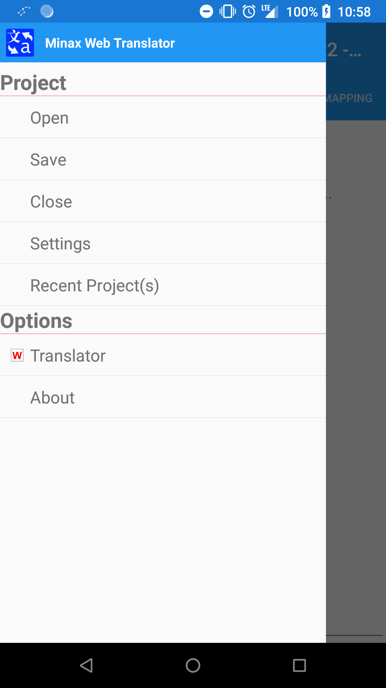

 

---

## Translator Selection
There are many Translators or Translation Services provided by this App.
However, The Android version has less selection due to the limitation of operating system.  

Besides, not every Translating engine can translate any source language to target language.
Therefore, I only put 2 source languages and 2 target languages in the App options, that is because I am more familiar with them.

The rules of Translator selection are very simple:
1. Select the engine which is familiar with source language
   - The Google Translate come from America, it is more familiar with English.
   - The Excite Translator come from Japan, it is more familiar with Japanese.
   - The Baidu Translator come from China, it is more familiar with Chinese.
2. Select the engine which is familiar with target language
   - By 1., we understand and select a engine which is familiar with source language
   - That selected engine might not be familiar with target language
     - For exmaple, Chinese is Logogram, and English is Phonogram, the syntax and word sequence are very different with each other.
     - When you select Google Translate to translate English to Japanese, you may get a acceptable result. But in the reverse direction is not so.
     - When you select Baidu Translator to translate between Chinese and Japanese, the result is acceptable on bi-direction, that's because these two languages are Logogram.
3. Press (Translate button) and Pray
   - No matter what, these Translating engines are Machine Translation, you should not expect them would translate very well!!

If you do not understand what I talk about, you could try every engine many times to find what is the best for you. 

