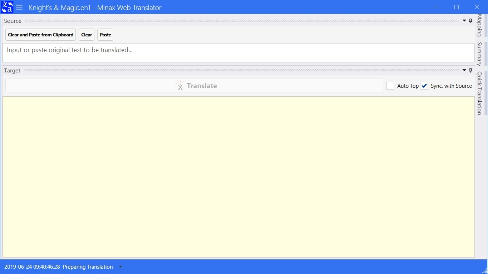

# Overview
**Minax Web Translator** app is not a translator. It just an agent and text mapping-replacer for remote web translator/translation result.
It works with some online web sites and APIs, such as Excite, CROSS-transer, Weblio, Baidu, Youdao, Google, Microsoft/Bing etc..

- Wiki: https://github.com/nuthrash/Minax/wiki
- Sample Projects: https://github.com/nuthrash/Minax/tree/master/MinaxWebTranslator/TranslationProjects

---
---

# Usage and Requirements
## Windows Desktop
- Project Folder: [MinaxWebTranslator.Desktop](https://github.com/nuthrash/Minax/tree/master/MinaxWebTranslator/MinaxWebTranslator.Desktop)
- System Requirement
  1. Operating System: Windows 7 Service Pack 1 (SP1) and above
  2. .Net Framework: [4.7](https://dotnet.microsoft.com/download/dotnet-framework/net47) and above
  3. Privilege Access: local storage, network

### Main Window

- Startup

- Draggable and Dockable Panels

  - You can drag and dock each panel to anywhere
  - And restore original docking layout by Menu -> Panel Layout -> Restore Default  
 
 

- Hidable Panels

  - You can hide some panels to focus on Target panel

### Menu
- Project New, Open, Save, Close, and Recent Project(s)

  - Create New Project: Menu -> Project -> New  
  - Open Existed Project: Menu -> Project -> Open  
  - Save Opened Project: Menu -> Project -> Save  
  - Close Opened Project: Menu -> Project -> Close  
  - Open One of Recent Project(s): Menu -> Project -> Recent Project(s) -> Click desired project  
    - When mouse stop on one recent project item, it would popup tooltip table to show some information about it.  
 

- Translator
  - Select Translator and fill required field(s): Menu -> Translator
    
  - When select a **charged** Translation API, you might fill required field(s) or keep blank util click Translate button to ask it or them.
  

### Translating
- Step 1: Open or create a Translation Project
- Step 2: Select a desired Translator (Menu -> Translator)
- Step 3: Create/Modify some mapping item in Mapping panel
- Step 4: Fill some text to Source box in Source panel
- Step 5: Clcik Translate button in Target panel

  - The translated text would show on the Target box in Target panel.  
  - The mapped text would be marked with **bold**.  

---

## Xamarin.Forms
- Base Project Folder: [MinaxWebTranslator](https://github.com/nuthrash/Minax/tree/master/MinaxWebTranslator/MinaxWebTranslator)
- System Requirement
  1. Operating System: depends on each platform sub-package
  2. Privilege Access: local storage, network

### Android
- Project Folder: [MinaxWebTranslator.Android](https://github.com/nuthrash/Minax/tree/master/MinaxWebTranslator/MinaxWebTranslator.Android)
- System Requirement
  1. Operating System: Android 5.0 (API Level 21 - Lollipop) and above
  2. Target API Version: Android 9.0 (API Level 28 - Pie)
  3. Privilege Access: local storage, network, cache, diagnostic, account, external store, write settings, write secure settings

#### Main Page
- Startup

#### Menu
- No project opened

- Project opened (some menu items would show after project opened)

