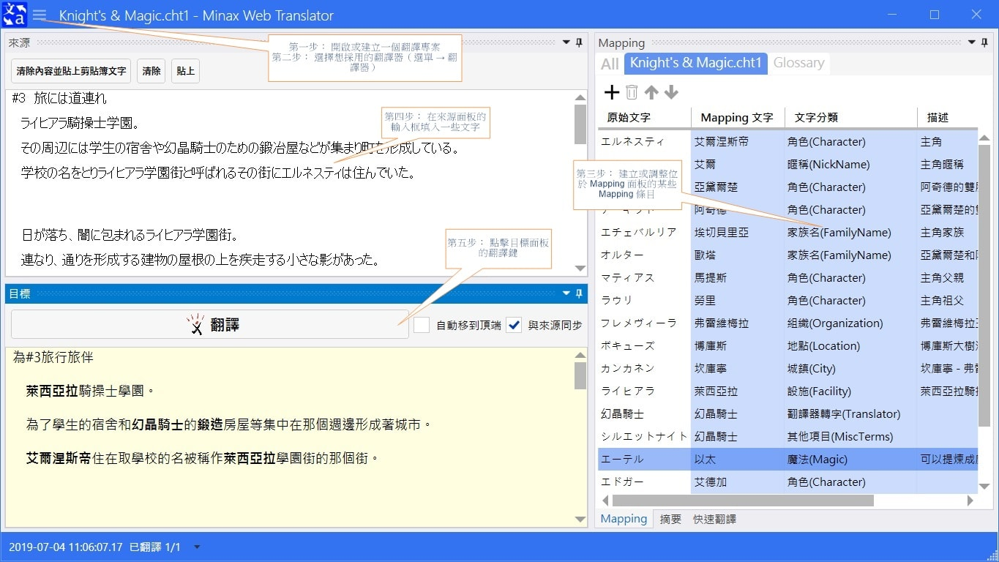

# 概觀
**Minax Web Translator** 程式**並非**翻譯器。僅是個遠端翻譯器或翻譯服務的**代理者與對應文字替換器**罷了。
其工作運作原理是依靠一些線上網站與 APIs，比如說**Excite、CROSS-transer、Weblio、Baidu、Youdao、Google、Microsoft/Bing**等等。

- 維基： [https://github.com/nuthrash/Minax/wiki](https://github.com/nuthrash/Minax/wiki)
- 翻譯專案範例： [https://github.com/nuthrash/Minax/tree/master/MinaxWebTranslator/TranslationProjects](https://github.com/nuthrash/Minax/tree/master/MinaxWebTranslator/TranslationProjects)

 

---

# 概念與翻譯服務 API 資訊
參見 [Conepts.zh-Hant.md](./Concepts.zh-Hant.md)
 
 

---

# 用法與需求
## Windows 桌面版
- 專案目錄： [MinaxWebTranslator.Desktop](https://github.com/nuthrash/Minax/tree/master/MinaxWebTranslator/MinaxWebTranslator.Desktop)
- 系統需求：
  1. 作業系統： Windows 7 Service Pack 1 (SP1) 含以上
  2. .Net Framework [4.7](https://dotnet.microsoft.com/download/dotnet-framework/net47) 含以上、.Net Core [3.1](https://dotnet.microsoft.com/download/dotnet-core/3.1)，或是.Net [5.0](https://dotnet.microsoft.com/download/dotnet-core/5.0)
  3. 存取權限： 本地端儲存、網路

### 主視窗

- 剛啟動

 

- 可拖拉與停駐的面板

  - 可以拖拉並到處停駐每個面板  
  - 並且恢復到原始面板停駐佈局，經由 選單 → 面板佈局 → 恢復原始佈局  
 
 

- 可隱藏面板

  - 可以隱藏某些面板以聚焦在目標（Target）面板上

### 選單
- 專案新建、開啟、儲存、關閉和最近使用專案

  - 建立新專案： 選單 → 專案 → 新建  
  - 開啟現存專案： 選單 → 專案 → 開啟  
  - 儲存已開啟專案： 選單 → 專案 → 儲存  
  - 關閉已開啟專案： 選單 → 專案 → 關閉  
  - 開啟一個最近專案： 選單 → 專案 → 最近使用專案 → 點擊某個想開啟的專案  
    - 當滑鼠停駐在某個最近使用專案項目上時，會蹦現出關於該專案的提示表格 
 

- 翻譯器
  - 選擇某個翻譯器並填寫必要欄位： 選單 → 翻譯器
    
  - 當選擇一個**收費**翻譯服務 API時，你可能需要填入一些必要內容或是先留空直到點擊翻譯鍵時才詢問內容
  

 

### 翻譯
此為本程式的主要功能，主要是用來翻譯較長的文章
- 第一步： 開啟或建立一個翻譯專案
- 第二步： 選擇想採用的翻譯器（選單 → 翻譯器）
- 第三步： 建立或調整位於 Mapping 面板的某些 Mapping 條目
- 第四步： 在來源面板的輸入框填入一些文字
- 第五步： 點擊目標面板的翻譯鍵

  - 翻譯完成的文字會顯示在目標面板的目標輸入框中  
  - 對應到的文字會以**粗體字**標記  

   

### 快速翻譯
這是個簡化的快速翻譯功能，主要是用來翻譯一小段文字，
因此輸入框可輸入文字長度被限制最長500個字。

基本用法類似主要的翻譯功能，除此之外還可以選擇多個翻譯器來同時翻譯一小段文字。
而「整合輸出」框則是將所有勾選的翻譯器輸出整合在一起。

 

---

## Xamarin.Forms
- 基礎專案目錄： [MinaxWebTranslator](https://github.com/nuthrash/Minax/tree/master/MinaxWebTranslator/MinaxWebTranslator)
- 系統需求：
  1. 作業系統： 依據每個子專案的平台而不同
  2. 存取權限： 本地端儲存、網路

### Android
- 專案目錄： [MinaxWebTranslator.Android](https://github.com/nuthrash/Minax/tree/master/MinaxWebTranslator/MinaxWebTranslator.Android)
- 系統需求
  1. 作業系統： Android 5.0 (API Level 21 - Lollipop) 含以上
  2. 目標 API 版本： Android 9.0 (API Level 28 - Pie)
  3. 存取權限： 本地端儲存、網路、快取、診斷、帳戶、外部儲存、設定寫入、安全性設定寫入
- 不支援功能
  1. App 休眠後自動載入原來狀態
  2. 檔案變動監視

 

#### 主頁面
- 剛啟動

 
 

#### 選單
- 尚未開啟專案  
 

- 已開啟專案（某些選單項目會在開啟專案後顯示出來） 
 

 
 

---

## 翻譯器選擇
本程式有許多不同的翻譯器或是翻譯服務可供選擇。
但是，Android 版則是由於作業系統的限制僅能提供較少選擇。  

除此之外，並非所有翻譯引擎可以支援任何來源語言和目標語言的翻譯。
因此，我只有在 App 選項中放上2個來源語言和2個目標語言，這是因為我比較熟習這些語言。

選擇翻譯器的規則很簡單：
1. 選擇較熟悉來源語言的引擎
   - 來自美國的 Google Translate，比較熟悉英文
   - 來自日本的 Excite Translator，比較熟悉日文
   - 來自中國的百度翻譯器，比較熟悉中文
2. 選擇較熟習目標語言的引擎
   - 根據 1.，可以了解並選擇了較熟悉來源語言的引擎
   - 所選引擎有可能不熟悉目標語言
     - 比如說，中文是一種語素文字（Logogram），而英文則是一種拼音文字（Phonogram），這兩種文字的文法和排列差別很大。
     - 當選用 Google Translate 來翻譯從英文到日文的內容時，你會發現翻譯結果是還可接受的。但是反方向則並不一定如此。
     - 當選用百度翻譯器來互譯中文和日文，其翻譯結果在兩個方向都是可接受的，這是因為這兩種語文都是語素文字。
3. 按下（翻譯鍵）並祈禱
   - 不管怎樣，這些翻譯引擎都是機器翻譯（Machine Translation），實在不應該期待它們會翻的完美無缺！！

如果你看不懂我在說些什麼，你可以多方嘗試每個引擎來找出最適合你用的引擎。

 

### 服務可用性
本程式基本上非常依賴遠端網路翻譯服務，不管是經由網頁或是網路 API。
沒有任何程式可以保證遠端服務永遠在線或是一直可用，這是因為網路和服務可用性是非常依靠使用者環境的。  

因此，當你在翻譯時遇到某些問題時，第一件事就是檢查你的環境並重試。
有時候，那只是因為網路延遲所造成的。
也許在重試操作後，就可以重新運作了。  

除了網路問題之外，仍有許多狀況會造成操作失敗。  
其中之一就是服務提供者改變了他們的 HTML 程式。另一個則是他們擋掉了超出流量的翻譯要求。  
後者也許可以在幾個小時後重試來解決。  
前者則需由程式設計師來看看發生了啥事。

### Mapping 概念
本程式主要功能之一就是將某段文字在翻譯過程中替換為另一段文字，這就是所謂的 Mapping。

Mapping 的主要用法：
1. 保留原始文字
   - 有些文字在不同的翻譯器翻譯過程中會被換成不一樣的文字，但是該段文字在這個專案中應該是不需要被翻譯的
   - 此時可以將「原始文字」和「Mapping 文字」兩個欄位輸入同樣內容，以確保在翻譯過程不會錯譯了該段文字
2. 清除某些文字
   - 有些時候翻譯器翻完後的排版不是很好，需要再手動刪除或是增加
   - 通常這種狀況是用在增加或是刪減空白字
3. 自行翻譯
   - 基本上這是絕大多數的用法。翻譯器的詞彙基本上稱不上是最新的，更不會知道某些論文自創的縮寫是什麼意思，所以要自行替換
   - 在「原始文字」填入來源語言文字，在「Mapping 文字」欄位中填入目標語言文字
   - 在翻譯時，程式會自動將<u>來源輸入框</u>的文字中包含「原始文字」的內替換為不會被取代的字串後，執行遠端翻譯，最後將遠端翻譯的內容替換為「Mapping 文字」內容

